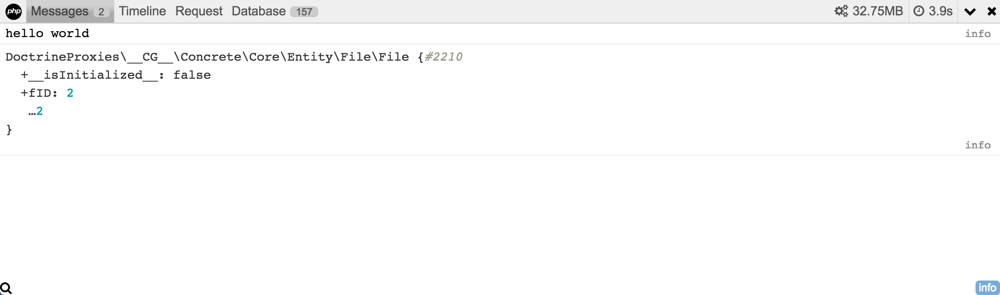

# Concrete CMS DebugBar

A package to integrate [PHP Debug Bar](http://phpdebugbar.com/) with Concrete CMS.

## Usage

### Messages

You can add messages to this tab using compatible usage with [PSR-3 logger](https://github.com/php-fig/fig-standards/blob/master/accepted/PSR-3-logger-interface.md).

```php
\Core::make('debugbar/messages')->info('hello world');
\Core::make('debugbar/messages')->info($object);
```



### Timeline

You can check a timeline within the runtime.
You can also add log the execution time of a particular operation.

```php
\Core::make('debugbar/time')->startMeasure('longop', 'My long operation');
sleep(2);
\Core::make('debugbar/time')->stopMeasure('longop');
```


### Request

You can check how Concrete retrieve request data in this tab.


### Session

You can check values stored in the current session.


### Database

You can check all sql queries on current request in this tab.


### Logs

You can check application logs (same as dashboard/reports/logs but you can quick access!).


### Environment

Get some information about the server/application environment.


